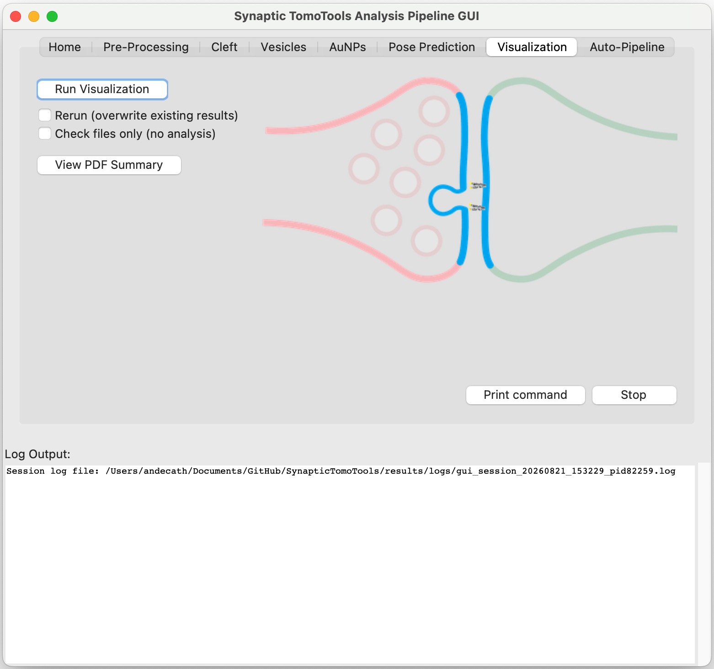
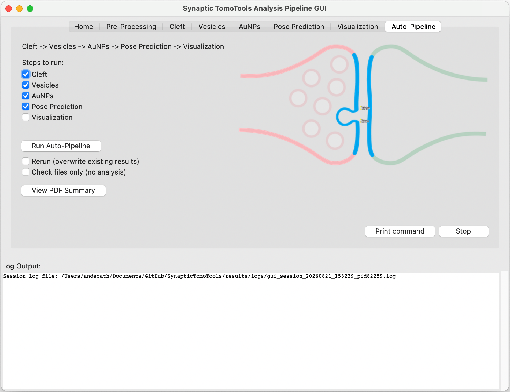
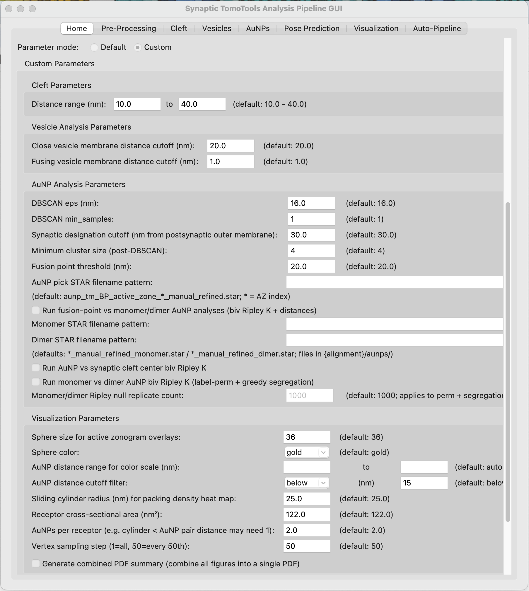

# SynapticTomoTools

```text
╔═╗┬ ┬┌┐┌┌─┐┌─┐┌┬┐┬┌─┐╔╦╗┌─┐┌┬┐┌─┐╔╦╗┌─┐┌─┐┬  ┌─┐
╚═╗└┬┘│││├─┤├─┘ │ ││   ║ │ │││││ │ ║ │ ││ ││  └─┐
╚═╝ ┴ ┘└┘┴ ┴┴   ┴ ┴└─┘ ╩ └─┘┴ ┴└─┘ ╩ └─┘└─┘┴─┘└─┘
```
A Python toolkit for running various analyses on cryo-electron tomography (cryo-ET) data, with a focus on analyzing ~2 nm AuNP labels within brain tissue-derived synapse tomograms.

---

## 🚀 STT Features

- GUI and Command-line interface for easy pipeline execution
- Wrapper to "FindingAMPA" repo for tomogram preprocessing steps
- Synaptic cleft identification
- Vesicle fitting
- AuNP analyses (DBSCAN clustering, density, AuNP-AuNP nearest neighbor and AuNP-membrane distances)
- AuNP and cleft membrane-guided receptor pose prediction

## ⏯️ Workflow

Before running analysis modules, tilt series should first be processed using Etomo and then tomograms should be reconstructed and further processed using the FindingAMPA preprocessing pipeline (which is a standalone repo, or is installed as a python package within the SynapticTomoTools environment). Within the findingampa pipeline, tomogram reconstruction, denoising (wrapper to DeepDeWedge with pretrained models), membrane segmentation (wrapper to Membrain), membrane and vesicle annotation (wrapper to Blender-based manual annotation platform), and AuNP picking (template-matching approach constrained to cleft regions) need to be completed.

Following pre-processing, the following analysis modules can be run.

Modules should be run in the following order:

1. Cleft
2. Vesicles
3. AuNPs
4. Pose Prediction
5. Visualization

---

## 📦 Installation

Requires **Python ≥ 3.8**, conda (or mamba), git, and network access (FindingAMPA is installed from GitHub).

```bash
git clone https://github.com/catler4/SynapticTomoTools.git
cd SynapticTomoTools

conda create -n STT python=3.11
conda activate STT

# Installs this package (editable) and all runtime dependencies from pyproject.toml
pip install -e .
```

After install, launch the GUI with `python scripts/pipeline_gui.py`, or use the CLI via `python -m src.synaptic_tomo_tools.cli --help` or `synaptic-tomo-tools --help`.

---

## 🖥️ Graphical User Interface (GUI)

You can run the analysis pipeline using a graphical interface:

- Launch the GUI with:
  ```bash
  python scripts/pipeline_gui.py
  ```    
- The GUI provides:
  - A Home tab to select your tomogram CSV and root directory
  

  - A Pre-Processing tab to run commands from the FindingAMPA github repo (preprocessing for this workflow)
  

  - Tabs for each analysis step individually (Cleft, Vesicles, AuNPs, Pose Prediction, Visualization)
  
  
  
  
  

  - An Auto-Pipeline tab to auto-run selected analysis steps in order
  

  - Custom parameters option on Home tab to change analysis parameters
  

  - Live log output for all analysis steps that also gets saved as log file.

---

### Command Line Interface

You can also run the analysis from the command line. Commands to run pipeline can be printed in the GUI using the "Print command" button.

## Outputs

Outputs are written in two places:

1. **Repo-level** under `results/` (pooled CSVs, combined figures/PDFs)
2. **Per-tomogram** under `{tomogram}/{alignment_dir}/STT_results/`

`alignment_dir` comes from each CSV row (e.g. `best_alignment`).

### Cleft

- `results/cleft/cleft_results.csv` — one row per tomogram + cleft (areas, max span, cleft-width stats)
- `results/cleft/all_cleft_distances.csv` — average cleft width per cleft
- `results/cleft/all_cleft_measurements.csv` — individual cleft distance measurements
- `results/analysis_results.json` — nested results for all completed analyses
- Per tomogram: `{alignment_dir}/STT_results/cleft/`
  - surface point clouds (`cleft_pre*_post*_pre_outer.txt`, etc.)
  - `cleft_mapping.json`, `membrane_volumes.json`

### Vesicles

- `results/vesicles/vesicles_results.csv` — tomogram-level vesicle summary
- `results/vesicles/all_vesicle_data.csv` — all individual vesicles across tomograms
- Per tomogram: `{alignment_dir}/STT_results/vesicles/vesicle_results.json`

### AuNPs

- `results/aunps/aunps_results.csv` — per-cleft AuNP summary rows
- `results/aunps/all_aunp_distances.csv` — per-AuNP distances / metrics
- `results/aunps/aunp_cluster_results.csv` — cluster summaries pooled across tomograms
- `results/aunps/close_vesicles_fusion_point_to_aunp_distances.csv` — per-(vesicle, AuNP) distances from close-vesicle fusion points
- `results/aunps/fusing_vesicles_fusion_point_to_aunp_distances.csv` — same for fusing vesicles
- Optional / checkbox-gated analyses also under `results/aunps/` (Ripley curves, Prism envelopes, packing-density CSVs, and related figures under `results/aunps/figures/`)
- Per tomogram: `{alignment_dir}/STT_results/aunps/`
  - `aunp_clusters.csv`, `aunp_clusters.star`
  - nearest-neighbor / distance tables and other AuNP analysis files

### Pose prediction

- Per tomogram: `{alignment_dir}/STT_results/poses/` (method subdirs such as `all_poses/`, `greedy/`, `ilp/`)
  - RELION STAR files for poses, paired/unpaired AuNPs, summaries, optional PDBs
- Pooled across a GUI/CLI batch: `results/poses/` (combined STAR files)

### Visualizations

- Per tomogram: `{alignment_dir}/STT_results/visualizations/`
  - slice overlays such as `{tomo_name}_vesicles_clefts_*.png`, `{tomo_name}_vesicles_aunps_*.png`, `{tomo_name}_combined_*.png`
  - cluster / synaptic-designation overlays when generated
- Organized copies: `results/visualizations/{tomogram_name}/{alignment_dir}/`
- Active zonograms: `{alignment_dir}/STT_results/visualizations/active_zonograms/` and under `results/visualizations/.../active_zonograms/`
- PDF summaries: `results/visualizations/pdf_summaries/` (including `all_tomograms_summary.pdf` when PDF generation is enabled)

---

## 📁 Data organization

Tomograms are grouped by experimental set under a root directory (GUI: Home tab root; CLI: `TOMO_ROOT_BASE`, default `data/`). Paths are built as:

`{root}/{set}/TOP_TOMOS/{tomoname}/{alignment_dir}/`

`alignment_dir` comes from the CSV (e.g. `best_alignment`, `liza_az0`) — there is no default.

### Layout

```text
{root}/
└── {set}/
    └── TOP_TOMOS/
        └── {tomoname}/
            └── {alignment_dir}/
                ├── {tomoname}_ddw.mrc          # DeepDeWedge volume (viz; optional for some analyses)
                ├── aunps/                      # primary analysis inputs
                │   ├── presynapticmembranes.glb
                │   ├── postsynapticmembranes.glb
                │   ├── presynapticmembranes_1.txt
                │   ├── postsynapticmembranes_1.txt
                │   ├── synapticvesicles_1.txt
                │   ├── synapticvesicles_2.txt
                │   ├── aunp_tm_BP_active_zone_0_manual_refined.star
                │   └── aunp_tm_BP_active_zone_1_manual_refined.star
                └── STT_results/                # written by the pipeline; later steps read these
                    ├── cleft/
                    ├── vesicles/
                    ├── aunps/
                    ├── poses/
                    └── visualizations/
```

Pick STAR filenames still use `active_zone` in the name; analysis outputs and the optional CSV column use `cleft` / `cleft_IDs`.

### Input files by analysis

| Analysis | Required inputs under `{alignment_dir}/` |
|----------|------------------------------------------|
| **Cleft** | `aunps/presynapticmembranes.glb`, `aunps/postsynapticmembranes.glb` |
| **Vesicles** | `aunps/synapticvesicles_*.txt`, `aunps/presynapticmembranes_*.txt`, plus prior `STT_results/cleft/` surfaces |
| **AuNPs** | `aunps/aunp_tm_BP_active_zone_*_manual_refined.star` (default pattern), membrane `*_*.txt`, plus prior `STT_results/cleft/` |
| **Pose Prediction** | same AuNP pick STAR pattern, `aunps/postsynapticmembranes.glb` |
| **Visualization** | `*ddw.mrc`, membrane `*_*.txt`, plus prior cleft / vesicle / AuNP `STT_results/` outputs |

Optional AuNP analyses (GUI checkboxes) may also use monomer/dimer pick STARs:

- `aunp_tm_BP_active_zone_*_manual_refined_monomer.star`
- `aunp_tm_BP_active_zone_*_manual_refined_dimer.star`

The pick STAR pattern is configurable in the GUI/CLI (default: `aunp_tm_BP_active_zone_*_manual_refined.star`, where `*` is the cleft index).

### File formats

#### Membrane meshes (`.glb`) — cleft + poses
- **Location:** `{alignment_dir}/aunps/`
- **Files:** `presynapticmembranes.glb`, `postsynapticmembranes.glb`
- Cleft definition and pose prediction read these meshes (not the TXT point clouds).

#### Membrane / vesicle point clouds (`.txt`)
- **Location:** `{alignment_dir}/aunps/`
- **Files:** `presynapticmembranes_*.txt`, `postsynapticmembranes_*.txt`, `synapticvesicles_*.txt`
- **Format:** one XYZ coordinate per line (whitespace-separated). Indices in the filename (e.g. `_1`, `_2`) label separate segmentations. Vesicle inner/outer membranes may both be present; inner membranes are filtered later.

#### AuNP pick STARs
- **Location:** `{alignment_dir}/aunps/`
- **Default pattern:** `aunp_tm_BP_active_zone_*_manual_refined.star` (one file per cleft index)
- **Format:** [STAR](https://www.ccpem.ac.uk/download/starfile.php) table with AuNP coordinates in `faCoordinateX`, `faCoordinateY`, `faCoordinateZ`
- Cleft association comes from the filename index (and from CSV `cleft_IDs` when set), not from a required `active_zone` column inside the STAR

#### Tomogram volume (`*_ddw.mrc`)
- **Location:** `{alignment_dir}/`
- **Format:** [MRC](https://en.wikipedia.org/wiki/MRC_(file_format)) density map (typically DeepDeWedge-denoised)
- Required for Visualization overlays; optional for some other steps

### Tomogram CSV

Use a CSV (e.g. under `tomogram_csv_files/` or `data/tomograms.csv`) to list tomograms to process. Set the root in the GUI or via `TOMO_ROOT_BASE`. Which analyses run is chosen in the GUI/CLI (`--analysis` / selected tabs), not by per-row flags.

**Required columns:**
- `tomoname` — tomogram directory name under `{set}/TOP_TOMOS/`
- `set` — experimental set name (used to build `{root}/{set}/TOP_TOMOS/`)
- `alignment_dir` — alignment subdirectory for that row (required; no default)

**Optional:**
- `cleft_IDs` — cleft indices to use (e.g. `0`, `2`, or `"0,2"`). Empty = all matching pick STAR indices. Quote comma-separated lists (e.g. `"0,2"`).

**Example:**
```csv
tomoname,set,alignment_dir,cleft_IDs
20231017_EGmilled24-2_68,15F1,best_alignment,2
20231017_HippAu_141,15F1,best_alignment,"0,2"
20231026_HippAu_26,15F1,liza_az0,
```

---
