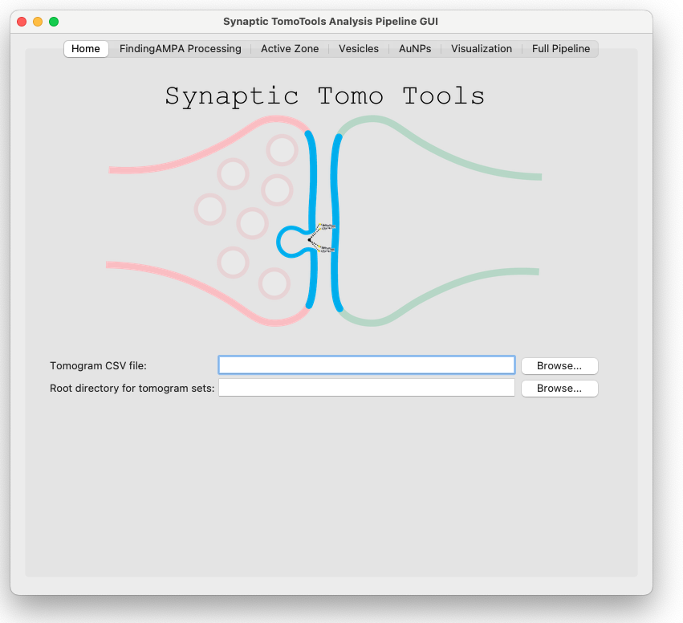
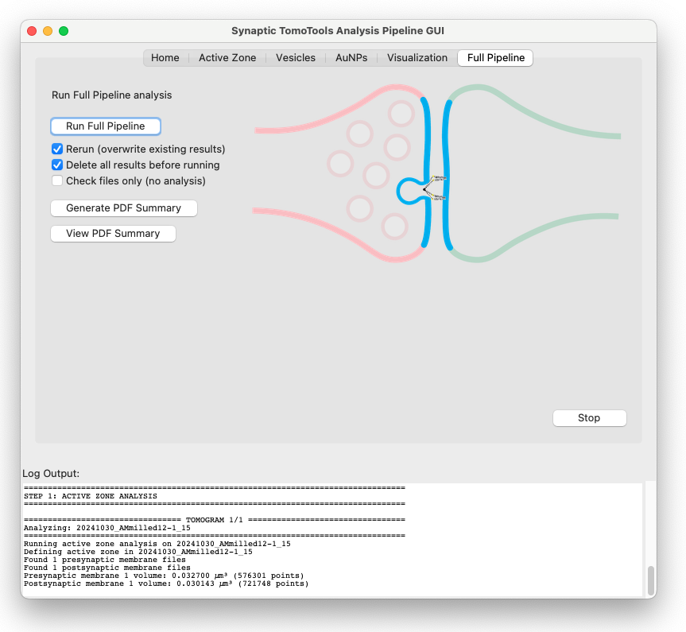
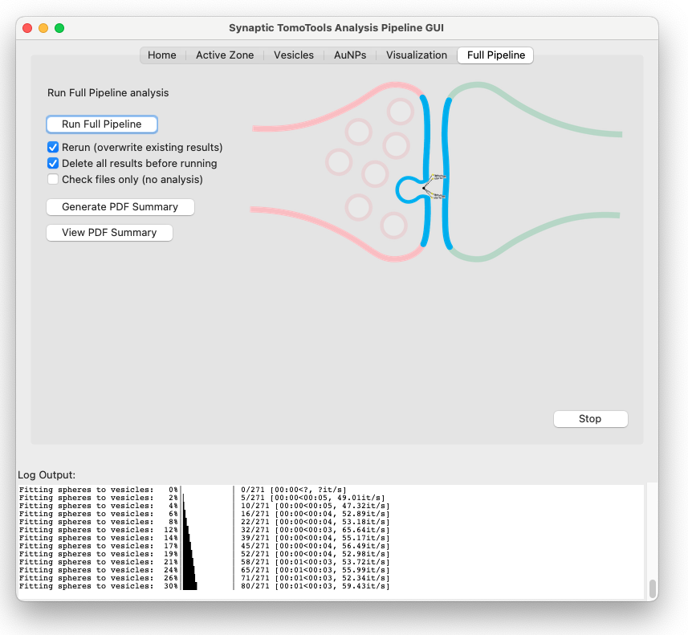
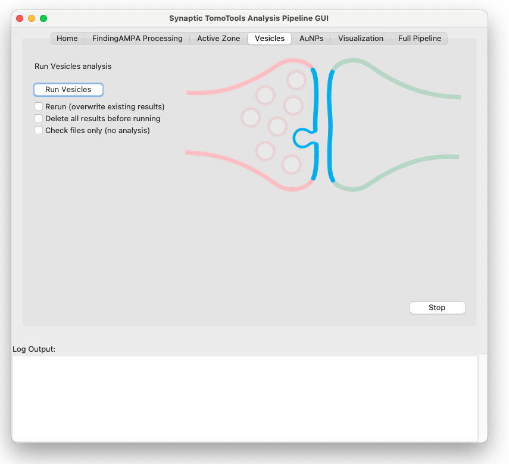
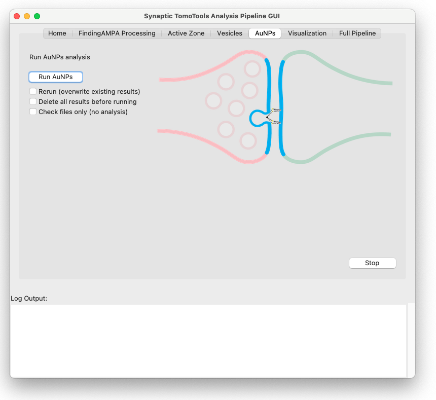
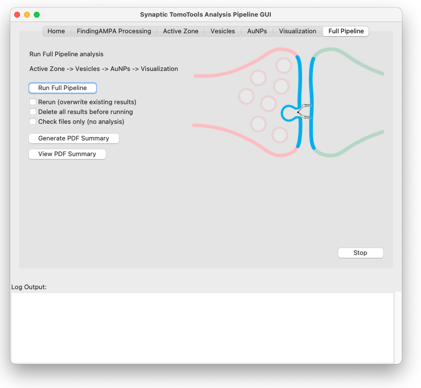

# SynapticTomoTools

```text
╔═╗┬ ┬┌┐┌┌─┐┌─┐┌┬┐┬┌─┐╔╦╗┌─┐┌┬┐┌─┐╔╦╗┌─┐┌─┐┬  ┌─┐
╚═╗└┬┘│││├─┤├─┘ │ ││   ║ │ │││││ │ ║ │ ││ ││  └─┐
╚═╝ ┴ ┘└┘┴ ┴┴   ┴ ┴└─┘ ╩ └─┘┴ ┴└─┘ ╩ └─┘└─┘┴─┘└─┘
```
A Python toolkit for running various analyses on cryo-electron tomography (cryo-ET) data, with a focus on synaptic structures.

---

## 🚀 Features

- Quantitative measurements
    - Active zone identification
    - Synaptic cleft width measurement
    - Presynaptic vesicle volume, diameter, localization, enclosed signal analyses
    - Presynaptic vesicle fusion site estimation
    - AuNP label nearest neighbor distances
    - AuNP label to active zone membrane and vesicle fusion site distances
    - AuNP label cluster analyses
- Command-line interface for easy pipeline execution
- Automated visualization generation

## ⏯️ Workflow

Before running analysis modules, tilt series should first be processed using etomo within IMOD and then tomograms should be reconstructed and further processed using the findingampa preprocessing pipeline, which is installed as a python package within the SynapticTomoTools environment. Within the findingampa pipeline, tomogram reconstruction, denoising (using DeepDeWedge), membrane segmentation (using Membrain), membrane annotation (manual input using Blender), and AuNP picking (custom template matching approach constrained to active zones) will be carried out.

Following findingampa pipeline processing, the following analysis modules can be run.

Modules should be run in the following order:

1. activezone
2. vesicles
3. aunps
4. visualization

---

## 📦 Installation

Clone the repository:

```bash
git clone https://github.com/catler4/SynapticTomoTools.git
cd SynapticTomoTools
pip install -r requirements.txt

```

---

## 🖥️ Graphical User Interface (GUI)

You can run the analysis pipeline using a graphical interface:

- Launch the GUI with:
  ```bash
  python scripts/processing_and_analysis_pipeline_gui.py
  ```  
  
  
- The GUI provides:
  - A Home tab to select your tomogram CSV and root directory (with browse buttons)
  - A FindingAMPA tab to run commands from the FindingAMPA github repo (preprocessing for this workflow)
  - Tabs for each analysis step (Active Zone, Vesicles, AuNPs, Visualization, Full Pipeline)
  - Figure previews for each analysis step
  - Run controls and checkboxes for key CLI flags (rerun, delete-results, check-files)
  - Live log output for all analysis steps
  - Buttons to generate and view the PDF summary directly from the GUI
- The GUI uses the same CLI workflow under the hood, so all results and outputs are identical to running the CLI directly.

  
  
  
  
  

---

### Command Line Interface

You can also run the analysis from the command line.

Run from the project root:

```bash
python -m src.synaptic_tomo_tools.cli --analysis all
```

### Key CLI Flags

| Flag                        | Description                                                                                      |
|-----------------------------|--------------------------------------------------------------------------------------------------|
| `--analysis`                | **Required.** Which analysis to run. Choices: `activezone`, `vesicles`, `aunps`, `visualizations`, `all` |
| `--set`                     | (Optional) Filter tomograms by experimental set name (e.g., 15F1, unlabeled)                    |
| `--csv`                     | Path to CSV file listing tomograms and analysis flags (default: `data/tomograms.csv`)            |
| `--rerun`                   | Rerun analysis on already completed steps and overwrite existing results                                 |
| `--results-dir`             | Directory to store analysis results (default: `results`)                                         |
| `--calculate-vesicle-signals` | Calculate vesicle signal intensity (slower but provides signal data)                           |
| `--delete-results`          | **Delete all analysis results files before running analysis**                                    |
| `--check-files`             | Check that all expected files for the tomograms listed in the CSV are present in the expected locations. No analysis is run. |
| `--test`                    | Use local test data roots and default to `data/tomograms-test.csv` unless `--csv` is specified. All test set roots are set relative to the repo root. Supported test sets: 15F1, 5F11, 15F1and5F11, 15F1and5F11dimer, 11B8, unlabeled. |
| `--generate-pdf-summary`   | Generate a PDF summary for all tomograms at the end of the analysis pipeline. This will run the PDF summary script automatically after all analyses and exports are complete. |

### Example: Active Zone Analysis

```bash
python -m src.synaptic_tomo_tools.cli --analysis activezone
```

### Example: Full Pipeline on non-default tomogram test set

```bash
python -m src.synaptic_tomo_tools.cli --analysis all --test
```

### Example: Full Pipeline with All Options

```bash
python -m src.synaptic_tomo_tools.cli --analysis all --csv data/tomograms.csv --rerun --calculate-vesicle-signals --delete-results
```

### Example: Vesicle Analysis with Signal Calculation

```bash
python -m src.synaptic_tomo_tools.cli --analysis vesicles --calculate-vesicle-signals
```

### Test Mode

The `--test` flag switches the pipeline to use local test data directories and defaults to `data/tomograms-test.csv` for the tomogram list (unless you specify `--csv`).

- All test set roots are set as relative paths from the repository root, so the code works on any machine where the repo is cloned.
- Supported test sets: `15F1`, `5F11`, `15F1and5F11`, `15F1and5F11dimer`, `11B8`, `unlabeled`.
- Example usage:

```bash
python -m src.synaptic_tomo_tools.cli --analysis all --test
```

You can override the CSV file with `--csv` if you want to use a different test list.

### Checking Required Files

You can use the `--check-files` flag to verify that all required input files for the tomograms listed in your CSV are present in the expected locations. This is useful for dataset validation before running the full analysis pipeline.

**Example usage:**

```bash
python -m src.synaptic_tomo_tools.cli --analysis all --csv data/tomograms.csv --check-files
```

This will print a summary for each tomogram, listing any missing files or confirming that all required files are present. No analysis or file modification will occur.

### See All Options

For the latest options and descriptions, run:
```bash
python -m src.synaptic_tomo_tools.cli --help
```

---

## Outputs

- **Active zone results:**
  - `results/activezone/activezone_results.csv` — per active zone (one row per tomogram + active zone): areas, AZ distances, cleft width stats
  - `results/activezone/all_cleft_distances.csv` — average cleft width per active zone (one row per tomogram + active zone)
  - `results/activezone/all_cleft_measurements.csv` — individual cleft distance measurements (one row per point pair)
  - `results/analysis_results.json` — full nested results (including tomogram-level summaries)
  - Per-tomogram surface coordinates in each tomogram's `{alignment_dir}/STT_results/activezone/`
- **Vesicle results:**
  - `results/vesicle_results.csv` — summary statistics for all tomograms
  - `results/all_vesicle_data.csv` — all individual vesicle data for all tomograms
  - Per-tomogram results in each tomogram's `best_alignment/STT_results/vesicles/` (e.g., `vesicle_results.json`)
- **AuNP results:**
  - `results/aunp_results.csv` — summary statistics for all tomograms
  - `results/all_aunp_distances.csv` — all per-AuNP distances for all tomograms
  - `results/close_vesicles_aunp_histograms.csv` — AuNP distance histograms from fusion points for close vesicles (<20 nm from active zone)
  - `results/fusing_vesicles_aunp_histograms.csv` — AuNP distance histograms from fusion points for fusing vesicles (spherical perimeter within 5 nm of active zone)
  - Per-tomogram results in each tomogram's `best_alignment/aunps/` (e.g., `aunp_nearest_neighbor_distances.csv`)
- **AuNP cluster analysis outputs:**
  - `best_alignment/STT_results/aunps/aunp_clusters.csv`: Per-cluster summary (cluster label, number of AuNPs, area, max dimension, density)
  - `best_alignment/STT_results/aunps/aunp_clusters.star`: Per-AuNP cluster assignments in STAR format
  - `results/aunp_cluster_results.csv`: All cluster summary info from all tomograms (like vesicle_results.csv)
  - `results/visualizations/aunps_and_vesicles/{tomogram_name}_combined_aunpclusters.png`: Combined overlay with all AuNPs colored by cluster assignment (noise in grey)
- `results/visualizations/aunps_and_vesicles/{tomogram_name}_aunpclusters.png`: All AuNPs colored by cluster, best 2D projection (noise in grey)
- **Combined results:**
  - `results/analysis_results.json` — all results for all tomograms in a single JSON
- **Summary figures and PDFs:**
  - `results/summary_pdfs/` — summary plots by analysis type and set:
    - `aunp_aunp_count_by_set.png` — AuNP counts by experimental set
    - `aunp_nearest_neighbor_distance_mean_by_set.png` — Average nearest neighbor distances by set
    - `vesicle_vesicle_detection_average_vesicle_diameter_by_set.png` — Average vesicle diameters by set
    - `vesicle_vesicle_detection_vesicle_count_by_set.png` — Vesicle counts by set
    - `vesicle_vesicles_within_10nm_by_set.png` — Vesicles within 10nm of active zone by set
    - Additional AuNP metrics: 
      - `aunp_density_by_set.png` — AuNP density (AuNPs per unit volume) by set
      - `aunp_distance_to_active_zone_center_mean_by_set.png` — Average distance to active zone center by set
      - `aunp_cluster_n_aunps_by_set.png` — Number of AuNPs per cluster by set
      - `aunp_cluster_cluster_area_by_set.png` — Cluster area by set
      - `aunp_cluster_cluster_density_by_set.png` — Cluster density by set
      - `aunp_cluster_count_by_set.png` — Number of clusters per tomogram by set
  - `results/summary_pdfs/all_tomograms_summary.pdf` — comprehensive PDF summary of all analyses
- **Visualizations:**
  - **Per-tomogram images:**
    - `best_alignment/STT_results/visualizations/` inside each tomogram directory:
      - `{tomo_name}_vesicles_active_zones.png`: Vesicles and active zones
      - `{tomo_name}_aunps.png`: Vesicles and AuNPs (filtered by aunp_active_zones)
      - `{tomo_name}_combined.png`: All elements together
      - `{tomo_name}_vesicles_signal.png`: Vesicles colored by average signal intensity (gradient fill)
  - **Combined images:**
    - `results/visualizations/aunps_and_vesicles/` — copies of all per-tomogram images for easy access

---

## 📁 Data organization

### Required File Formats

Each tomogram directory must contain the following files in the specified locations and formats:

#### `presynapticmembranes_*.txt` and `postsynapticmembranes_*.txt`
- **Location:** `best_alignment/aunps/`
- **Format:** Plain text file. Each line contains three whitespace-separated numbers representing the X, Y, Z coordinates of a point on the membrane segmentation.
- **Example:**
  ```text
  123.4 567.8 90.1
  124.0 568.2 90.3
  ...
  ```

#### synapticvesicles_*.txt
- **Location:** `best_alignment/aunps/`
- **Format:** Plain text file. Each line contains three whitespace-separated numbers representing the X, Y, Z coordinates of a point on the vesicle surface or center.
- **Example:**
  ```text
  200.1 300.2 50.0
  201.0 301.1 50.2
  ...
  ```
- **Notes:**
  - Multiple files may exist (e.g., `synapticvesicles_1.txt`, `synapticvesicles_2.txt`, ...), each corresponding to a different vesicle segmentation. Inner and outer vesicle membranes can be segmented individually. If this is the case, the inner membrane will be removed from analysis in a later filtering step.

#### aunp_tm_BP_active_zone_*.star
- **Location:** `best_alignment/aunps/`
- **Format:** [STAR file](https://www.ccpem.ac.uk/download/starfile.php) (Self-defining Text Archival and Retrieval format), typically used in cryo-EM. Contains a table of AuNP coordinates and metadata.
- **Key columns:**
  - `faCoordinateX`, `faCoordinateY`, `faCoordinateZ`: Coordinates of each AuNP.
  - `active_zone`: Index of the active zone the AuNP is associated with.
- **Example:**
  ```
  data_
  loop_
  _faCoordinateX _faCoordinateY _faCoordinateZ _active_zone
  100.0 200.0 50.0 0
  101.2 201.5 50.1 0
  ...
  ```
- **Notes:**
  - There may be multiple files, one per active zone (e.g., `aunp_tm_BP_active_zone_0.star`, `aunp_tm_BP_active_zone_1.star`, ...).

#### *_ddw.mrc
- **Location:** `best_alignment/`
- **Format:** [MRC file](https://en.wikipedia.org/wiki/MRC_(file_format)), a standard format for electron density maps in cryo-EM.
- **Purpose:** Used as the tomogram volume for visualization overlays and analysis. Typically the best version of a tomogram for visualization (e.g. denoised or filtered) is used. We typically use the DeepDeWedge denoised (ddw) versions of tomograms.
- **Notes:**
  - The filename must end with `_ddw.mrc` and match the tomogram's name prefix.

### Required File Organization

Tomograms are grouped by sets based on experimental conditions and marked for certain analyses in /data/tomograms.csv

The cli.py must be updated with the root directories for each of the tomogram sets, in which each tomogram's data should be stored in a separate directory. Or, within the gui a main root directory can be designated that assumes a specific organizational structure and naming for the subdirectories.

Within each tomogram subdirectory, a best_alignment/aunps subdirectory is expected that contains the pre- and postsynaptic membrane segmentations (presynapticmembranes_1.txt, postsynapticmembranes_1.txt, ...), vesicle segmentations (synapticvesicles_1.txt, synapticvesicles_2.txt, ...), and aunp picks saved in individual .star files per active zone (aunp_tm_BP_active_zone_0.star, aunp_tm_BP_active_zone_1.star, ...).

```text
TOMOGRAM_SET_ROOT/
├── TOP_TOMOS/
│   ├── tomogram1/
│   │   ├── best_alignment/
│   │   │   ├── tomogram1_ddw.mrc (tomogram that will be used for visualizations)
│   │   │   ├── aunps/
│   │   │   │   ├── presynapticmembranes_1.txt
│   │   │   │   ├── postsynapticmembranes_1.txt
│   │   │   │   ├── synapticvesicles_1.txt
│   │   │   │   ├── synapticvesicles_2.txt
│   │   │   │   └── aunp_tm_BP_active_zone_0.star
│   ├── tomogram2/
│   │   ├── best_alignment/
│   │   │   ├── tomogram2_ddw.mrc
│   │   │   ├── aunps/
│   │   │   │   ├── presynapticmembranes_1.txt
│   │   │   │   ├── presynapticmembranes_2.txt
│   │   │   │   ├── postsynapticmembranes_1.txt
│   │   │   │   ├── synapticvesicles_1.txt
│   │   │   │   ├── synapticvesicles_2.txt
│   │   │   │   ├── aunp_tm_BP_active_zone_0.star
│   │   │   │   └── aunp_tm_BP_active_zone_1.star
...
```


The `data/tomograms.csv` file controls which tomograms are analyzed and how. Each row corresponds to a tomogram and specifies which analyses to run and (optionally) which AuNP active zones to use.

### **Required columns:**
- `tomoname`: Name of the tomogram directory (matches folder name under your set root)
- `set`: Experimental set name (must match a key in your SET_ROOTS in cli.py)
- `activezone`: `True` or `False` — whether to run active zone analysis
- `vesicles`: `True` or `False` — whether to run vesicle analysis
- `aunps`: `True` or `False` — whether to run AuNP analysis
- `aunp_active_zones` (optional): Comma-separated list of active zone numbers (e.g., `"0,2"`).
    - If empty, all numbered `aunp_tm_BP_active_zone_*.star` files are used.
    - If set, only those indices are used (e.g., `2` → only `aunp_tm_BP_active_zone_2.star`).

### **Example:**
```csv
tomoname,set,activezone,vesicles,aunps,aunp_active_zones
20231017_EGmilled24-2_68,15F1,True,True,True,"2"
20231017_HippAu_141,15F1,True,True,True,"0,2"
20231026_HippAu_26,15F1,True,True,True,
```

---